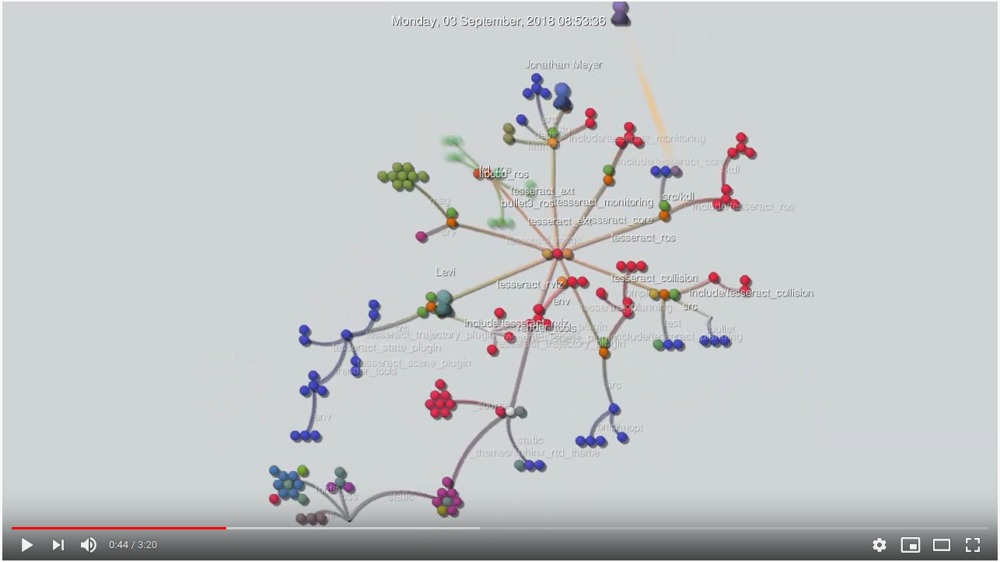

# Tesseract

[](https://codecov.io/gh/tesseract-robotics/tesseract)

[](https://github.com/tesseract-robotics/tesseract_python)


Platform             | CI Status
---------------------|:---------
Linux (Focal)        | [](https://github.com/tesseract-robotics/tesseract/actions)
Linux (Bionic)       | [](https://github.com/tesseract-robotics/tesseract/actions)
Windows              | [](https://github.com/tesseract-robotics/tesseract/actions)
Lint  (Clang-Format) | [](https://github.com/tesseract-robotics/tesseract/actions)
Lint  (CMake-Format) | [](https://github.com/tesseract-robotics/tesseract/actions)
Lint  (Clang-Tidy)   | [](https://github.com/tesseract-robotics/tesseract/actions)
Lint  (CodeCov)      | [](https://github.com/tesseract-robotics/tesseract/actions)

[](http://github.com/tesseract-robotics/tesseract/issues)

[](https://opensource.org/licenses/Apache-2.0)
[](https://opensource.org/licenses/BSD-2-Clause)

[](http://rosindustrial.org/news/2016/10/7/better-supporting-a-growing-ros-industrial-software-platform)

The planning framework (Tesseract) was designed to be light weight, limiting the number of dependencies, mainly only using standard libraries like, eigen, boost, orocos and to the packages below. The core packages are ROS agnostic and have full python support.

## Dependencies
[](https://github.com/ros-industrial/ros_industrial_cmake_boilerplate/tree/0.2.15)  
[](https://github.com/Jmeyer1292/opw_kinematics/tree/0.4.5)

## Tesseract Setup Wizard and Visualization Tools

[](https://snapcraft.io/tesseract-ignition)

## Python Installation

A self contained Tesseract Python package is available on PyPI for Windows 10+, Ubuntu 20.04, and Ubuntu 22.04. This package
contains Tesseract, Tesseract Planning, and all dependencies in the single package. Packages are available for Python
3.7 - 3.10.

To install on Windows:
```
python -m pip install tesseract-robotics tesseract-robotics-viewer
```
To install on Ubuntu 20.04 and Ubuntu 22.04:

```
sudo apt install python3-pip python3-numpy
# The supplied version of pip on Ubuntu 20.04 is too old for manylinux_2_31, upgrade pip
python3 -m pip install -U pip
python3 -m pip install --user  tesseract_robotics tesseract_robotics_viewer
```

## Tesseract Core Packages

* **tesseract** – This is the main class that manages the major component Environment, Forward Kinematics, Inverse Kinematics and loading from various data.
* **tesseract_command_language** – This package contains a generic command language to support motion and process planning similar to industrial teach pendants
* **tesseract_collision** – This package contains a common interface for collision checking prividing several implementation of a Bullet collision library and FCL collision library. It includes both continuous and discrete collision checking for convex-convex, convex-concave and concave-concave shapes.
* **tesseract_common** – This package contains common functionality needed by the majority of the packages.
* **tesseract_environment** – This package contains the Tesseract Environment which provides functionality to add,remove,move and modify links and joint. It also manages adding object to the contact managers and provides the ability.
* **tesseract_geometry** – This package contains geometry types used by Tesseract including primitive shapes, mesh, convex hull mesh, octomap and signed distance field.
* **tesseract_kinematics** –  This package contains a common interface for Forward and Inverse kinematics for Chains, Trees and Graphs including implementation using KDL and OPW Kinematics.
* **tesseract_scene_graph** – This package contains the scene graph which is the data structure used to manage the connectivity of objects in the environment. It inherits from boost graph and provides addition functionality for adding,removing and modifying Links and Joints along with search implementation.
* **tesseract_support** – This package contains support data used for unit tests and examples throughout Tesseract.
* **tesseract_visualization** – This package contains visualization utilities and libraries.

## Related Repositories

* [Tesseract Planning](https://github.com/tesseract-robotics/tesseract_planning)
* [Tesseract Python](https://github.com/tesseract-robotics/tesseract_python)
* [Tesseract ROS](https://github.com/tesseract-robotics/tesseract_ros)
* [Tesseract Documentation](https://github.com/tesseract-robotics/tesseract_docs)

## Documentation

* [Wiki](https://tesseract-docs.readthedocs.io)
* [Doxygen](https://tesseract-robotics.github.io/tesseract/)
* [Benchmark](https://tesseract-robotics.github.io/tesseract/dev/bench)

## Evolution

[](https://www.youtube.com/watch?v=rxlzlsSBxAY)

How to create:

* Create Video: `gource -1280x720 -seconds-per-day 0.2 --auto-skip-seconds 0.2 --disable-bloom -background d0d3d4 --hide filenames,mouse,progress -o - | ffmpeg -y -r 60 -f image2pipe -vcodec ppm -i - -vcodec libx264 -preset ultrafast -pix_fmt yuv420p -crf 1 -threads 0 -bf 0 gource.mp4`
* Create Gif: `ffmpeg -i gource.mp4 -r 10 -vf "scale=800:-1,split[s0][s1];[s0]palettegen[p];[s1][p]paletteuse" tesseract_evolution.gif`

## TODO's

Warning: These packages are under heavy development and are subject to change.

See [issue #66](https://github.com/tesseract-robotics/tesseract/issues/66)

## Build Instructions

1) Clone repository into your workspace
2) Clone the repositories in the dependencies.rosinstall file using wstool or some other method (e.g. manually git cloning them)
3) Build the workspace using catkin tools, colcon, or a similar tool

NOTE: For noetic tesseract_ext is not required. Install the following dependencies: libbullet-dev, libbullet-extras-dev and ros-noetic-fcl. Taskflow can be install using the PPA below.

NOTE: To speed up clean build you may want to add tesseract_ext to an extended workspace.

NOTE: Install TaskFlow from [ROS-Industrial PPA](https://launchpad.net/~ros-industrial/+archive/ubuntu/ppa).

### Building with Clang-Tidy Enabled

Must pass the -DTESSERACT_ENABLE_CLANG_TIDY=ON to cmake when building. This is automatically enabled if cmake argument -DTESSERACT_ENABLE_TESTING_ALL=ON is passed.

### Building Tesseract Tests

Must pass the -DTESSERACT_ENABLE_TESTING=ON to cmake when wanting to build tests. This is automatically enabled if cmake argument -DTESSERACT_ENABLE_TESTING_ALL=ON is passed.

NOTE: If you are building using catkin tools, use `catkin build --force-cmake -DTESSERACT_ENABLE_TESTING=ON`.

#### Running Tesseract Tests

Tesseract packages use ctest because it is ROS agnostic, so to run the test call `catkin test --no-deps tesseract_collision tesseract_common tesseract_environment tesseract_geometry tesseract_kinematics tesseract_scene_graph tesseract_urdf tesseract_command_language`

### Building Tesseract Code Coverage

Must pass the -DTESSERACT_ENABLE_CODE_COVERAGE=ON to cmake when wanting to build code coverage. The code coverage report is located in each individuals build directory inside a ccov/all-merged folder. Open the index.html file to see the packages code coverage report.

NOTE: Must be a clean build when generating a code coverage report. Also must build in debug.

#### Exclude Code From Code Coverage

- LCOV_EXCL_LINE
  - Lines containing this marker will be excluded.
- LCOV_EXCL_START
  - Marks the beginning of an excluded section. The current line is part of this section.
- LCOV_EXCL_STOP
  - Marks the end of an excluded section. The current line not part of this section.

.. NOTE: You can replace **LCOV** above with **GCOV** or **GCOVR**.

## Create Debian Package (Linux) or NuGet Package (Windows)

The following process will generate a Debian or NuGet package leveraging cmake and cpack based on the OS.

The package should be located in the current directory.

``` bash
cd <workspace directory>
catkin build -DCMAKE_BUILD_TYPE=Release -DTESSERACT_PACKAGE=ON
./src/tesseract/.run-cpack
```

.. NOTE: You can add a prefix to the package name by setting -DTESSERACT_PACKAGE_PREFIX="ros-noetic-".

## Quality Tools Leverage

Tesseract currently leverages Compiler Warnigs, Clang Tidy and Code Coverage. All warnings produced by Compiler and Clang Tidy are treated as errors during CI builds.

- Compiler
  - Wall
  - Wextra
  - Wconversion
  - Wsign-conversion
  - Wno-sign-compare
  - Wnon-virtual-dtor
- Clang Tidy
  - clang-analyzer-*
  - bugprone-*
  - cppcoreguidelines-avoid-goto
  - cppcoreguidelines-c-copy-assignment-signature
  - cppcoreguidelines-interfaces-global-init
  - cppcoreguidelines-narrowing-conversions
  - cppcoreguidelines-no-malloc
  - cppcoreguidelines-slicing
  - cppcoreguidelines-special-member-functions
  - misc-*,-misc-non-private-member-variables-in-classes
  - modernize-*,-modernize-use-trailing-return-type,-modernize-use-nodiscard
  - performance-*
  - readability-avoid-const-params-in-decls
  - readability-container-size-empty
  - readability-delete-null-pointer
  - readability-deleted-default
  - readability-else-after-return
  - readability-function-size
  - readability-identifier-naming
  - readability-inconsistent-declaration-parameter-name
  - readability-misleading-indentation
  - readability-misplaced-array-index
  - readability-non-const-parameter
  - readability-redundant-*
  - readability-simplify-*
  - readability-static-*
  - readability-string-compare
  - readability-uniqueptr-delete-release
  - readability-rary-objects

## Documentation and Tutorials
Documentation and tutorials for Tesseract are located at https://github.com/tesseract-robotics/tesseract_docs.git

## Debugging Windows Build

- Search Directories CI
  - dir /s /b c:\opt\ros\noetic\*assimp*
- Location of ROS Windows Builds
  - https://ros-win.visualstudio.com/ros-win/_build
  - https://ros-win.visualstudio.com/ros-win/_build/results?buildId=8711&view=artifacts&type=publishedArtifacts
