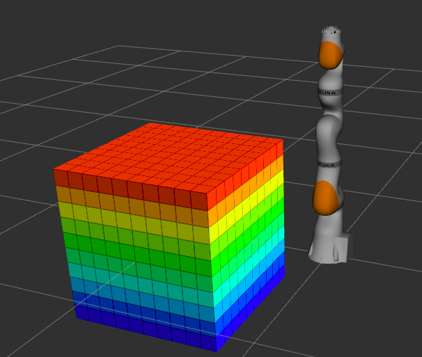

Tesseract Interface: ROSCPP
===========================

.. NOTE::
   This tutorial was heavily inspired from `MoveIt! tutorials <https://ros-planning.github.io/moveit_tutorials/doc/move_group_interface/move_group_interface_tutorial.html>`_.
   Credit should be recognized for the tutorial structure and some text content.

For Tesseract, the most common interface will be through ROS with the `tesseract_ros package <https://github.com/ros-industrial-consortium/tesseract_ros>`_.
It provides functionality for common operations such as setting joint or pose goals, creating motion plans,
moving the robot, adding objects into the environment, etc.

Getting Started
---------------
If you haven't already done so, make sure you've completed the steps in `Getting Started <./getting_started_doc.html>`_.

The Launch File
---------------
The entire launch file is `here on GitHub <https://github.com/ros-industrial-consortium/tesseract_ros/blob/master/tesseract_ros_examples/launch/basic_cartesian_example.launch>`_

Running the Code
----------------
Open a terminal, and launch the executable and Rviz. Wait for Rviz to finish loading: ::

    roslaunch tesseract_ros_examples basic_cartesian_example.launch

After Rviz opens, go back to the terminal where the launch file was executed, and the following text should be visible.
Robot motion in Rviz begins immediately upon pressing any key. ::

    [ERROR] [1613730481.601846614]: Hit enter key to continue!

Expected Output
---------------
In Rviz, the the robot should trace a trajectory in its environment on top of the cube object:

.. image:: ../_static/basic_cartesian_example_process.png
   :width: 700px

The Entire Code
---------------
The entire example code is written from one executable node that links against a `BasicCartesianExample(...)` class (installed as a library).

**Executable Node:**

* `basic_cartesian_example_node.cpp <https://github.com/ros-industrial-consortium/tesseract_ros/blob/master/tesseract_ros_examples/src/basic_cartesian_example_node.cpp>`_

**BasicCartesianExample(...) Class:**

* `basic_cartesian_example.h <https://github.com/ros-industrial-consortium/tesseract_ros/blob/master/tesseract_ros_examples/include/tesseract_ros_examples/basic_cartesian_example.h>`_
* `basic_cartesian_example.cpp <https://github.com/ros-industrial-consortium/tesseract_ros/blob/master/tesseract_ros_examples/src/basic_cartesian_example.cpp>`_

Next we step through the code piece by piece. The `basic_cartesian_example_node.cpp <https://github.com/ros-industrial-consortium/tesseract_ros/blob/master/tesseract_ros_examples/src/basic_cartesian_example_node.cpp>`_
initializes ROS, instantiates the `BasicCartesianExample(...)` class, and calls the `run()` method from the class.

.. rli:: https://raw.githubusercontent.com/ros-industrial-consortium/tesseract_ros/master/tesseract_ros_examples/src/basic_cartesian_example_node.cpp
   :language: c++

For the `BasicCartesianExample(...)` class within `basic_cartesian_example.cpp <https://github.com/ros-industrial-consortium/tesseract_ros/blob/master/tesseract_ros_examples/src/basic_cartesian_example.cpp>`_,
the translation unit is setup with using-declarations and required strings.

.. 'literalinclude' directive can be used if developing changes within a local workspace.
.. 'rli' directive should be used for final changes
.. .. literalinclude:: ../../../tesseract_ros/tesseract_ros_examples/src/basic_cartesian_example.cpp
.. rli:: https://raw.githubusercontent.com/KevinWarburton/tesseract_ros/update/documentation-tesseract-cpp-interface/tesseract_ros_examples/src/basic_cartesian_example.cpp
   :language: c++
   :start-after: // documentation:start:section_1
   :end-before: // documentation:end:section_1

The primary functionality is in the `run()` method of the class.

* Get parameters from the ROS Parameter Server and pass them into the Tesseract environment (`env_`).
* Create the environment monitor that understands contact points within the envrionment.
* Create an octomap of a cube that is given to the environment monitor.

.. 'literalinclude' directive can be used if developing changes within a local workspace.
.. 'rli' directive should be used for final changes
.. .. literalinclude:: ../../../tesseract_ros/tesseract_ros_examples/src/basic_cartesian_example.cpp
.. rli:: https://raw.githubusercontent.com/KevinWarburton/tesseract_ros/update/documentation-tesseract-cpp-interface/tesseract_ros_examples/src/basic_cartesian_example.cpp
   :language: c++
   :start-after: // documentation:start:section_3
   :end-before: // documentation:end:section_3

In the `addPointCloud()` method, we use the Point Cloud Library to create a cube. Then, the cube is transformed into an Octomap representation, and this
is passed to the Tesseract environment.

.. 'literalinclude' directive can be used if developing changes within a local workspace.
.. 'rli' directive should be used for final changes
.. .. literalinclude:: ../../../tesseract_ros/tesseract_ros_examples/src/basic_cartesian_example.cpp
.. rli:: https://raw.githubusercontent.com/KevinWarburton/tesseract_ros/update/documentation-tesseract-cpp-interface/tesseract_ros_examples/src/basic_cartesian_example.cpp
   :language: c++
   :start-after: // documentation:start:section_2
   :end-before: // documentation:end:section_2

Continuing in the `run()` method, we define motion parameters by:

* Setting cartesian waypoints and asking the planner to perform freespace and linear moves for different programs.
* Create a planning server that will solve each program for the robot's joint kinematics.
* Plot the trajectory in Rviz for animation.

.. 'literalinclude' directive can be used if developing changes within a local workspace.
.. 'rli' directive should be used for final changes
.. .. literalinclude:: ../../../tesseract_ros/tesseract_ros_examples/src/basic_cartesian_example.cpp
.. rli:: https://raw.githubusercontent.com/KevinWarburton/tesseract_ros/update/documentation-tesseract-cpp-interface/tesseract_ros_examples/src/basic_cartesian_example.cpp
   :language: c++
   :start-after: // documentation:start:section_4
   :end-before: // documentation:end:section_4
